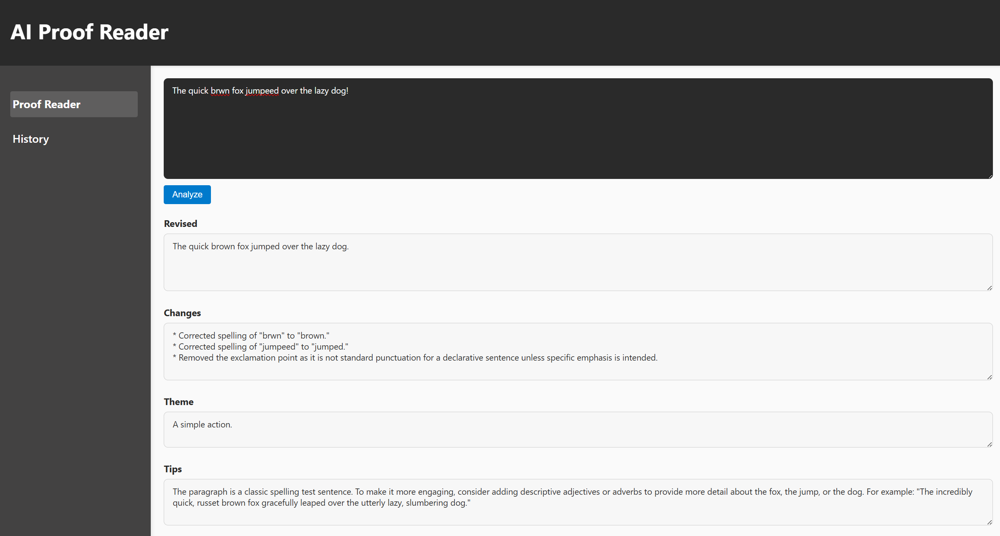

# AI Proof Reader

This repository contains a minimal proof‑of‑concept for a text proofreading App.



## Structure

```
/
├── backend/
│   ├── app/
│   │   ├── main.py         
│   │   ├── ai_service.py     
│   └── requirements.txt     
└── frontend/               
    ├── package.json         
    ├── vite.config.js       
    ├── index.html           
    ├── src/                 
    │   ├── main.jsx
    │   ├── App.jsx
    │   └── index.css
    └── dist/             
```
## Support Platforms
```
Windows 11 [TESTED]
Ubuntu 22-24 [Untested but should be compatible]
```
## Getting started

1. **Python backend**
   - Create a virtual environment and activate it (e.g. `python -m venv venv` & `venv\Scripts\activate`).
   - Install requirements:
     ```powershell
     pip install -r backend/requirements.txt
     ```
   - Setup API key using a `.env` file (preferred) or environment variable:

     1. **Add your API from your provider to `.env` at the repository root**. Currently only Gemini-API-keys are supported:
        ```text
        GEMINI_API_KEY=your_key_here
        ```
        
     2. The backend will automatically load this value when it start. **NOTE:Do not upload your api key on any public service**.

   - Start the API server:
     ```powershell
     uvicorn backend.app.main:app --reload
     ```
   - The server will serve both the API at http://localhost:8000/

2. **React frontend**

   - **Development**
     ```powershell
     cd frontend
     npm install      
     npm run dev
     ```

   - **Production build**
     ```powershell
     cd frontend
     npm install
     npm run build
     ```

## Notes

* This is the bare minimum working flow: a user pastes text, the front end sends it to `/analyze`,
  the backend calls Gemini via `ai_service.proofread_text` and returns output.
* Later iterations will add 
  - Database storage via MongoDb
  - Login and Sign up pages
  - History pages
  - Authentication

## Troubleshooting

* Incase of Errors please make sure your API_KEY is valid and correctly set in the environment variable using the following command in powershell
```powershell
$env:GEMINI_API_KEY
```
